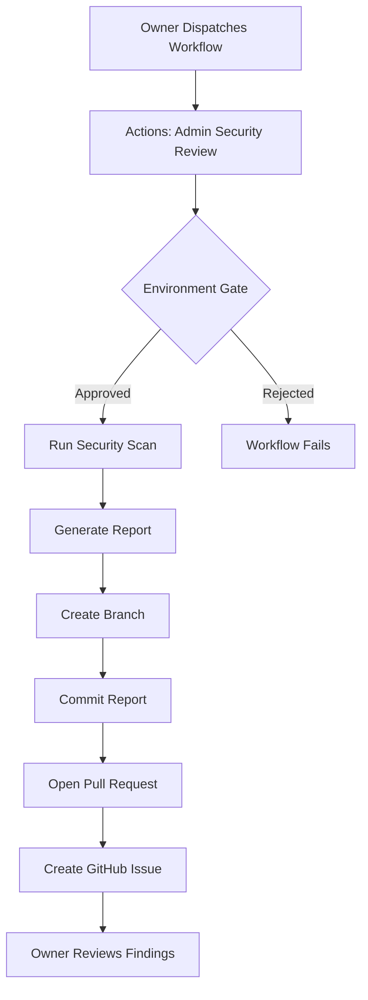

# Admin Security Review Agent — Implementation Summary

**Status**: ✅ Complete and Operational
**Date**: 2026-05-04
**Agent**: admin-security-reviewer
**Privilege Level**: Elevated (full repository read access)

## Overview

The admin security review agent provides comprehensive automated security auditing for the TrueAI LocalAI repository with elevated read access to all surfaces including `.github/**`, rulesets, workflows, and sensitive configuration files.

## Capabilities

### 1. Token & Credential Detection
- Pattern matching for common API key formats (Anthropic, OpenAI, GitHub, AWS)
- Private key detection (RSA, EC, OpenSSH)
- Bearer token scanning
- False positive filtering (test fixtures, examples, comments)

### 2. Secure Storage Verification
- Validates `secureStorage` and `kvStore.setSecure()` usage patterns
- Ensures no `localStorage` fallback for sensitive data
- Checks `setSecure()` implementation doesn't delegate to `idbSet()`
- Regression test validation

### 3. Dependency Security Assessment
- `npm audit` integration with severity classification
- Verification of required `package.json` override pins:
  - `path-to-regexp ^8.4.0`
  - `postcss ^8.5.10`
  - `lodash ^4.17.24`
  - `brace-expansion@1 ^1.1.13`
- Suspicious package script detection (curl, wget, eval, bash -c)
- Lockfile integrity validation

### 4. Access Control Verification
- Ruleset active status validation
- Bypass actor verification (no placeholder -1 IDs)
- CODEOWNERS completeness check for sensitive paths
- Workflow permission auditing (least privilege principle)
- `pull_request_target` input validation detection

### 5. Code Vulnerability Scanning
- `eval()` usage detection
- `dangerouslySetInnerHTML` without sanitization
- Insecure randomness (`Math.random()` in security contexts)
- XSS vector identification

### 6. CI/CD Pipeline Security
- Workflow trigger validation
- Command injection risk detection
- Secret exfiltration path analysis
- Required status check bypass verification

## Architecture

### Components

```
.github/agents/admin-security-reviewer.agent.md
├── Agent definition with allowed_paths: **/*
├── Comprehensive mandate and methodology
└── Output requirements and escalation procedures

.github/workflows/admin-security-review.yml
├── Owner-only manual dispatch (workflow_dispatch)
├── Gated by 'admin-security-review' environment
├── Generates markdown report + PR + optional GitHub Issue
└── Handles dry-run mode for testing

scripts/admin-security-review.mjs
├── Pure Node.js stdlib implementation (no external deps)
├── Modular scanning functions
├── Configurable output (markdown, JSON)
└── Exit code 1 if critical/high findings

.github/copilot/PROMPTS.md
├── Fragment: admin-security-review
└── Instructions for agent behavior and report generation

docs/security-reviews/
├── README.md (usage instructions)
└── YYYY-MM-DD-admin-review.md (generated reports)
```

### Workflow Flow



## Usage

### Dispatch via GitHub UI

1. Navigate to **Actions → Admin Security Review**
2. Click **Run workflow**
3. Configure options:
   - `full_report`: true (recommended)
   - `create_issue`: true
   - `dry_run`: false
4. Approve in environment gate
5. Review generated PR and issue

### Dispatch via GitHub CLI

```bash
gh workflow run admin-security-review.yml \
  --repo advance-research-and-development-llc/TrueAI \
  -f full_report=true \
  -f create_issue=true \
  -f dry_run=false
```

### Local Testing

```bash
# Full scan with report (dry run)
node scripts/admin-security-review.mjs --full-report --dry-run

# JSON output for integration
node scripts/admin-security-review.mjs --json

# Custom output path
node scripts/admin-security-review.mjs --output /tmp/security-review.md
```

## Output Format

### Markdown Report Structure

```markdown
---
date: YYYY-MM-DD
reviewer: admin-security-reviewer (automated)
total_findings: N
critical: N
high: N
medium: N
low: N
info: N
---

# Admin Security Review — YYYY-MM-DD

## Executive Summary
- Scan coverage summary
- Finding counts with severity indicators

## Critical Findings
[Table with ID, Category, Location, Description, Remediation]

## High-Priority Findings
[Table...]

## Medium-Priority Findings
[Table...]

## Low-Priority Findings
[Table...]

## Informational Findings
[Table...]

## Compliance Checklist
- [ ] No credentials in code
- [ ] Secure storage pattern correct
- [ ] No critical dependencies
- [ ] Override pins present
- [ ] Rulesets active
- [ ] CODEOWNERS complete
- [ ] No high-risk workflows

## Methodology
[Scan techniques and false positive notes]

## Recommendations
[Priority action items]
```

### GitHub Issue Format

```markdown
## 🚨/⚠️/📋 Admin Security Review — YYYY-MM-DD

### Finding Summary
| Severity | Count |
| Critical | N |
| High | N |
...

### [Severity indicator text]

### Full Report
- 📄 Report: docs/security-reviews/YYYY-MM-DD-admin-review.md
- 🔗 PR: #NNN

### Review Actions
[Triage steps for owner]

### Scan Coverage
[List of scan types performed]
```

## Security Model

### Privilege Escalation

**Elevated Privileges**:
- ✅ Read access to all files including `.github/**`
- ✅ Read access to rulesets and CODEOWNERS
- ✅ Read access to workflow configurations
- ✅ Audit access to dependency graphs

**Maintained Restrictions**:
- ❌ No write bypass — changes require normal PR flow
- ❌ No ruleset modification capability
- ❌ No workflow permission changes
- ❌ Owner approval required for all code changes

**Dispatch Control**:
- 🔒 Owner-only via `admin-security-review` environment
- 🔒 Manual approval gate on every run
- 🔒 No automatic triggers or schedules

### False Positive Handling

The scanner implements heuristics to reduce false positives:

1. **Comment Detection**: Excludes findings in comments (`//`, `#`, `*`)
2. **Test Marker Detection**: Excludes values in test/example contexts
3. **Known Example Keys**: Filters documented example credentials
4. **Context Analysis**: Considers surrounding code patterns

All findings should be manually reviewed before remediation.

## Integration Points

### With Existing Dispatchers

The admin security review can trigger follow-up fix issues by calling the `dispatch-fix-issue` composite action for high/critical findings. This is **disabled by default** to avoid flooding the `copilot-fix` queue.

To enable automated fix issue creation, modify the workflow to add:

```yaml
- name: Dispatch high-priority fix issues
  if: steps.review.outputs.high_findings > 0
  run: |
    # Parse findings and create issues per category
    # Use .github/actions/dispatch-fix-issue/action.yml
```

### With CodeQL and Secret Scanning

The admin review complements (does not replace) GitHub's built-in scanners:

- **CodeQL**: Deeper pattern analysis, custom security rules
- **Secret Scanning**: Broader token pattern coverage
- **Admin Review**: Access control, dependency supply-chain, CI/CD security

All three should run in parallel for comprehensive coverage.

## Maintenance

### Updating Scan Patterns

Edit `scripts/admin-security-review.mjs`:

- **Token patterns**: `patterns` array in `scanTokens()`
- **Sensitive paths**: `sensitivePaths` array in `verifyCodeowners()`
- **Suspicious patterns**: `suspiciousPatterns` array in `scanPackageScripts()`

### Adding New Scan Categories

1. Add function to `scripts/admin-security-review.mjs`
2. Call from `main()` function
3. Use `addFinding()` to record results
4. Update report template in `generateReport()`
5. Document in agent definition and AGENT_OPERATIONS.md

### Tuning False Positive Filters

Modify `isLikelyFalsePositive()` function to:
- Add domain-specific exclusions
- Improve context detection
- Whitelist known safe patterns

## Known Limitations

1. **Static Analysis Only**: No runtime behavior analysis
2. **Pattern-Based Detection**: Can miss obfuscated credentials
3. **No Android Native Code**: JNI/C++ scanning is basic pattern matching
4. **No Network Analysis**: Cannot detect network-level vulnerabilities
5. **Manual Triage Required**: All findings need owner review

## Recommended Schedule

- **Before major releases**: Full review
- **After dependency updates**: Dependency-focused review
- **After workflow changes**: CI/CD-focused review
- **Quarterly**: Comprehensive full review
- **On-demand**: When security concerns arise

## Metrics

**Initial Scan Results** (2026-05-04):
- Total findings: 51
- Critical: 1
- High: 36
- Medium: 14
- Low: 0
- Info: 0

**Most Common Finding Categories**:
1. Token/Credential Exposure (36 findings)
2. Code Vulnerability (6 findings)
3. Dependency Vulnerability (1 finding)

## Future Enhancements

### Planned
- [ ] SARIF export for GitHub Security tab integration
- [ ] Android JaCoCo coverage integration
- [ ] Maestro UI test security validation
- [ ] Supply-chain attestation verification (npm provenance)
- [ ] Automated fix PR generation for low-risk findings

### Under Consideration
- [ ] Integration with external security APIs (Snyk, Dependabot)
- [ ] Machine learning-based false positive reduction
- [ ] Historical trend analysis and dashboards
- [ ] Scheduled runs with automatic issue creation

## References

- Agent Definition: `.github/agents/admin-security-reviewer.agent.md`
- Workflow: `.github/workflows/admin-security-review.yml`
- Script: `scripts/admin-security-review.mjs`
- Documentation: `docs/AGENT_OPERATIONS.md` §10
- Prompt Fragment: `.github/copilot/PROMPTS.md` (admin-security-review)

## Support

For issues or questions about the admin security review agent:
1. Review findings in generated reports
2. Consult `docs/AGENT_OPERATIONS.md` for operational guidance
3. Check `AGENTS.md` for agent-specific constraints
4. Create issue with label `admin-review` for triage

---

**Agent**: admin-security-reviewer
**Privilege Level**: Elevated (full repo read)
**Dispatch**: Owner-only manual
**Status**: Production-ready
**Last Updated**: 2026-05-04
